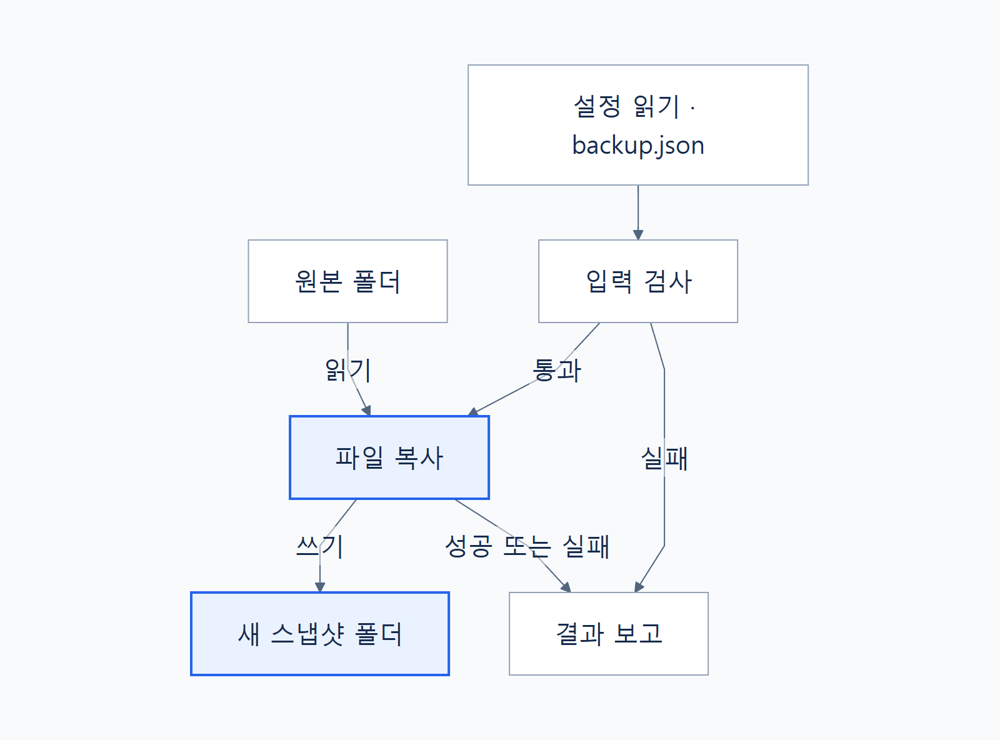

# 파일 백업 도구의 구조

설정 파일을 읽어 원본을 복사하고 결과를 보고하는 흐름을 파악합니다.

- **전체 역할:** 원본 파일을 실행별 새 스냅샷 폴더에 복사합니다.
- **중심 흐름:** 설정 읽기 → 입력 검사 → 파일 복사 → 결과 보고.
- **핵심 경계:** 검사 실패는 복사 전에 중단하고, 복사 실패는 불완전한 폴더를 남길 수 있습니다.

**바로가기:** [전체 구조도](#전체-구조도) · [구성요소와 역할](#구성요소와-역할) · [처리 흐름](#처리-흐름) · [의존성과 제약](#의존성과-제약) · [관련 문서](#관련-문서)

이 문서는 [가상 프로젝트의 공통 자료](source-notes.md)를 바탕으로 작성한 양식 예시입니다.

---

## 전체 구조도

파일 복사는 검사를 통과한 뒤 시작하며, 결과 보고에서 성공과 실패를 구분합니다.

사용자 요청으로 `backup.json`을 읽고, 입력 검사 후 원본을 새 스냅샷 폴더로 복사합니다. 검사나 복사가 실패하면 해당 단계에서 중단하고 실패를 보고합니다.

도식 원본: [backup-architecture.mmd](assets/backup-architecture.mmd)

---

## 구성요소와 역할

| 구성요소 | 역할 | 연결 대상 |
| --- | --- | --- |
| 설정 읽기 | JSON 설정을 읽습니다. | `backup.json`, 입력 검사 |
| 입력 검사 | 값·경로 관계·권한을 검사합니다. | 파일 복사, 결과 보고 |
| 파일 복사 | 폴더 구조를 유지하며 전체 파일을 복사합니다. | 원본 폴더, 새 스냅샷 폴더 |
| 결과 보고 | 성공 여부와 복사한 파일 수를 보여줍니다. | 사용자 |

---

## 처리 흐름

1. 사용자가 실행을 요청하면 `backup.json`을 읽습니다.
2. 필수 값, 경로 관계, 폴더와 권한을 검사합니다. 실패하면 복사 전에 중단합니다.
3. 대상 폴더 아래 새 폴더를 만들고 원본 파일을 복사합니다.
4. 성공 여부와 성공적으로 복사한 파일 수를 보고합니다.

복사 도중 오류가 나면 작업을 중단합니다. 남은 폴더는 불완전할 수 있으므로 폴더의 존재만으로 성공을 판단하지 않습니다.

---

## 의존성과 제약

### 로컬 파일 시스템

원본과 대상은 미리 준비한 로컬 폴더입니다. 원본은 읽기 가능하고 대상은 쓰기 가능해야 하며, 두 폴더는 같거나 서로 포함하는 관계일 수 없습니다.

### 실행 중 변경과 저장 공간

원본을 복사하는 동안 수정하면 시점의 일관성이 보장되지 않습니다. 매번 전체 파일을 복사하고 이전 사본을 자동 삭제하지 않으므로 저장 공간을 확인해야 합니다.

### 이 예시의 경계

자동 일정, 압축, 암호화, 복원 명령은 포함하지 않습니다. 로그 파일 형식과 스냅샷 이름 규칙도 이 자료에는 정의되어 있지 않습니다.

---

## 관련 문서

- [백업과 동기화의 차이](concept.md): 이전 시점의 사본을 남기는 이유.
- [설정 참조](reference.md): 검사 대상인 `source`와 `destination`.
