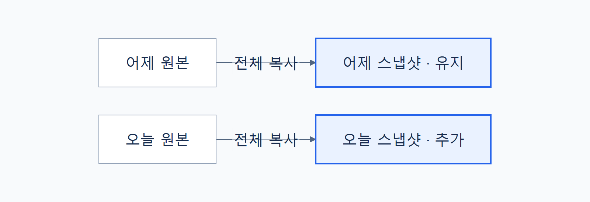

# 백업과 동기화의 차이

현재 파일을 맞추는 작업과 이전 시점의 사본을 남기는 작업의 차이를 이해합니다.

- **백업:** 실행 시점의 파일을 별도 사본으로 남깁니다.
- **동기화:** 이 문서에서는 대상 파일을 현재 원본 상태에 맞추는 방식을 뜻합니다.
- **핵심 차이:** 예시 도구는 새 스냅샷을 만들고 이전 스냅샷을 유지합니다.

**바로가기:** [필요한 이유](#필요한-이유) · [개념 도식](#개념-도식) · [핵심 원리](#핵심-원리) · [흔한 오해](#흔한-오해) · [관련 문서](#관련-문서)

이 문서는 [가상 프로젝트의 공통 자료](source-notes.md)를 바탕으로 작성한 양식 예시입니다.

---

## 필요한 이유

메모를 잘못 덮어썼을 때 현재 파일의 사본만으로는 어제의 내용을 찾기 어렵습니다. 이전 시점의 파일을 별도로 남겨두면 당시 내용을 확인할 수 있습니다.

---

## 개념 도식

원본이 바뀌어도 이전 스냅샷을 그대로 두고 새 사본을 추가합니다.

예를 들어 어제 백업한 뒤 오늘 메모를 수정하고 다시 백업하면, 두 실행 시점의 사본이 각각 남습니다. 두 사본을 만들려면 각 시점에 백업을 실행해야 합니다.

도식 원본: [backup-concept.mmd](assets/backup-concept.mmd)

---

## 핵심 원리

### 실행 시점의 사본

스냅샷은 한 번의 실행으로 복사한 파일 묶음입니다. 예시 도구는 매번 전체 파일을 새 폴더에 복사하므로 이전 사본을 덮어쓰지 않습니다.

### 보존과 저장 공간

이전 스냅샷은 자동으로 삭제되지 않습니다. 실행 횟수가 늘면 저장 공간도 더 필요합니다.

### 원본이 안정된 상태

복사하는 동안 원본을 수정하면 파일마다 서로 다른 시점의 내용이 담길 수 있습니다. 중요한 변경을 마친 뒤 수정 작업을 멈추고 백업해야 합니다.

---

## 흔한 오해

| 오해 | 실제 의미 |
| --- | --- |
| 백업을 한 번 켜면 이후 변경도 계속 저장된다 | 이 예시는 사용자가 실행할 때만 복사합니다. |
| 이전 스냅샷은 새 백업으로 바뀐다 | 이전 사본은 유지되고 새 폴더가 추가됩니다. |
| 폴더가 만들어졌으면 백업에 성공했다 | 복사 실패 시 불완전한 폴더가 남을 수 있습니다. |

---

## 관련 문서

- [백업 도구의 구조](architecture.md): 복사와 결과 보고가 이어지는 흐름.
- [설정 참조](reference.md): 원본과 저장 위치를 지정하는 두 설정.
